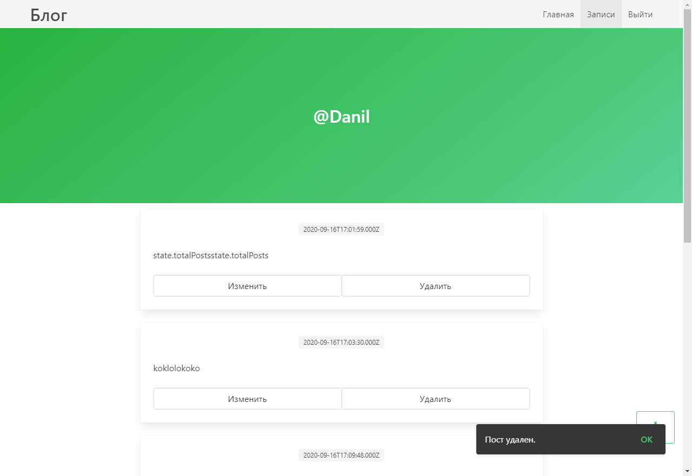

# blog-koa-vue-mysql

## Description
This project is an experiment and design is not the main thing in it.
Purpose of creation:
1. Mastering the node.js server framework;
1. SPA implementation (implemented using Vue.js);
1. Communication with the Api server through the client part;
1. Sending letters (implemented during user registration);
1. Using a mail framework and template engine when sending a letter.
1. Security with JWT and Bcrypt.

## Main technologies used:
1. Node.js
1. Koa.js - v2
1. Vue.js - v2
1. MySQL
1. Nodemailer
1. MJML
1. Jsonwebtoken
1. Bcrypt
1. Bulma.css
1. Buefy

## Tutorial install
1. Install MySQL (with workbench);
1. Created db with file in directory ./mysql/db_dump.sql. Completed this file in MySQL;
1. To use it is necessary to plug in your e-mail OAuth2 and paste in file ./server/config/config.js. Necessary data for the server to work with mail (required in the "email" object);
1. To install dependencies project enter in terminal "npm run server_install";
1. To start working web site enter in terminal "npm run start";
1. Go to URL in terminal.

## Example of work
1. Login/Signin system:

1. Just home page:

1. User records page:

1. Records editor:

## Other
- In directory ./client are all sources frontend.
- In directory ./screenshots are screenshot a working blog.
